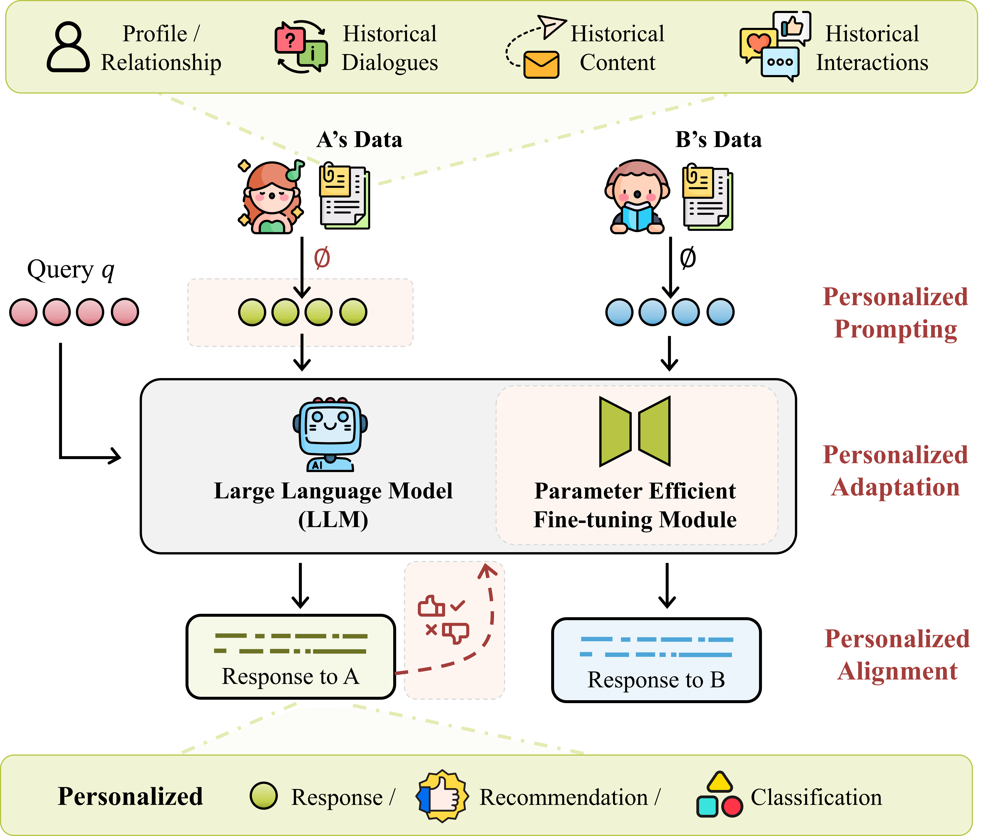

# Awesome Personalized Large Language Models (PLLMs)

This repository focuses on personalized large language models (LLMs) that leverage user data to generate tailored responses based on individual user preferences.

<table style="width: 100%;">
  <tr>
    <td style="width: 60%;">
      <ul>
        <li><a href="#personalized-prompting">Personalized Prompting</a></li>
        <ul>
          <li><a href="#profile-augmented-prompting-pag">Profile-Augmented</a></li>
          <li><a href="#retrieval-augmented-prompting-rag">Retrieval-Augmented</a></li>
          <li><a href="#soft-fused-prompting">Soft-Fused</a></li>
        </ul>
        <li><a href="#personalized-adaptation">Personalized Adaptation</a></li>
        <ul>
          <li><a href="#one-peft-all-users-one4all">One4All</a></li>
          <li><a href="#one-peft-per-users-one4one">One4One</a></li>
        </ul>
        <li><a href="#personalized-alignment">Personalized Alignment</a></li>
        <li><a href="#analysis">Analysis</a></li>
        <li><a href="#benchmark">Benchmark</a></li>
      </ul>
    </td>
    <td>
      
    </td>
  </tr>
</table>

---

## Personalized Prompting

### Profile-Augmented Prompting (PAG)

|  Method   |                                             Paper Title                                              |   Published At    |                                                                                                                                  Link                                                                                                                                  |
| :-------: | :--------------------------------------------------------------------------------------------------: | :---------------: | :--------------------------------------------------------------------------------------------------------------------------------------------------------------------------------------------------------------------------------------------------------------------: |
| *Cue-CoT* |      Cue-cot:Chain-of-thought prompting for responding to in-depth dialogue questions with llms      | EMNLP'23 Findings |                                                 |
|  *PAG*  |  Integrating Summarization and Retrieval for Enhanced Personalization via Large Lanuage Models |      CIKM'23       |                                    |
|  *ONCE*  | ONCE: Boosting Content-based Recommendation with Both Open- and Closed-source Large Language Models |      WSDM'24       |                     )  |
|  *Matryoshka* | Matryoshka: Learning to Drive Black-Box LLMs with LLMs |     Arxiv'24       |   |
|  *RewriterSlRl* | Learning to Rewrite Prompts for Personalized Text Generation |    WWW '24   |   |
|  _COS_ | CoS: Enhancing Personalization and Mitigating Bias with Context Steering |   Arxiv'24         |    |

### Retrieval-Augmented Prompting (RAG)

|  Method   |                                             Paper Title                                              |   Published At    |                                                                                                                                  Link                                                                                                                                  |
| :-------: | :--------------------------------------------------------------------------------------------------: | :---------------: | :--------------------------------------------------------------------------------------------------------------------------------------------------------------------------------------------------------------------------------------------------------------------: |
|  _MemPrompt_ | Memory-assisted prompt editing to improve GPT-3 after deployment |     EMNLP'22       |   |
| _TeachMe_  | Towards Teachable Reasoning Systems: Using a Dynamic Memory of User Feedback for Continual System Improvement |    EMNLP'22        |  |
|  _MaLP_ | LLM-based Medical Assistant Personalization with Short- and Long-Term Memory Coordination |   NAACL'24         |                       |
|   | Long-Term Memory for Large Language Models Through Topic-Based Vector Database |     IALP'23       |                      |
| *LD_Agent* | Hello Again! LLM-powered Personalized Agent for Long-term Dialogue |   Arxiv'24         |                       |
|  _MemoRAG_ | MemoRAG: Moving towards Next-Gen RAG Via Memory-Inspired Knowledge Discovery |   Arxiv'24         |                       |
| _LaMP_  | LaMP: When Large Language Models Meet Personalization |    ACL'24        |   |
| _MSP_  | Less is More: Learning to Refine Dialogue History for Personalized Dialogue Generation |    ACL'22        |     |
|  _AuthorPred_ | Teach LLMs to Personalize -- An Approach inspired by Writing Education  |     Arxiv'23      |                      |
|  _PEARL_ | Pearl: Personalizing Large Language Model Writing Assistants with Generation-Calibrated Retrievers |    CustomNLP4U@  EMNLP'24        |                      |
|  *ROPG / RSPG*| Optimization Methods for Personalizing Large Language Models through Retrieval Augmentation |  Arxiv'24          |                      |
|  _HYDRA_ | HYDRA: Model Factorization Framework for Black-Box LLM Personalization | NeurIPS'24           |                       |
|  *RECAP*  | RECAP: Retrieval-Enhanced Context-Aware Prefix Encoder for Personalized Dialogue Response Generation |      ACL'23       |                                           |

### Soft-Fused Prompting

|  Method   |                                             Paper Title                                              |   Published At    |                                                                                                                                  Link                                                                                                                                  |
| :-------: | :--------------------------------------------------------------------------------------------------: | :---------------: | :--------------------------------------------------------------------------------------------------------------------------------------------------------------------------------------------------------------------------------------------------------------------: |
| _UEM_  | User Embedding Model for Personalized Language Prompting |     PERSONALIZE@   ACL'24       |   |
| _PERSOMA_  | PERSOMA: PERsonalized SOft ProMpt Adapter Architecture for Personalized Language Prompting |  GenAIRecP@  KDD'24          |                     |
| *REGEN*  | Beyond Retrieval: Generating Narratives in Conversational Recommender Systems |    Arxiv'24        |  |
| *PeaPOD*  | Preference Distillation for Personalized Generative Recommendation |    Arxiv'24        |                       |
|  *User-LLM* | User-LLM: Efficient LLM Contextualization with User Embeddings |    Arxiv'24        |                      |
|  *RECAP*  | RECAP: Retrieval-Enhanced Context-Aware Prefix Encoder for Personalized Dialogue Response Generation |      ACL'23       |                                           |
| *GSMN*  | Personalized Response Generation via Generative Split Memory Network |     NAACL'21       |                      |

## Personalized Adaptation

### One PEFT All Users (One4All)

|  Method   |                                             Paper Title                                              |   Published At    |                                                                                                                                  Link                                                                                                                                  |
| :-------: | :--------------------------------------------------------------------------------------------------: | :---------------: | :--------------------------------------------------------------------------------------------------------------------------------------------------------------------------------------------------------------------------------------------------------------------: |
|  *PEFT-U* |       PEFT-U: Parameter-Efficient Fine-Tuning for User Personalization      |        Arxiv'24           |    |
|  *PLoRA* | Personalized LoRA for Human-Centered Text Understanding |     AAAI'24          |                    |
| *LM-P / CLS-P*  | Personalized Large Language Models |           SENTIRE@   ICMD'24 |                      |
|  UserIdentifier | UserIdentifier: Implicit User Representations for Simple and Effective Personalized Sentiment Analysis |   FL4NLP @  ACL'22         |                      |
| *Review-LLM*  | Review-LLM: Harnessing Large Language Models for Personalized Review Generation |      Arxiv'24      |                       |
|  *MiLP* | Personalized LLM Response Generation with Parameterized Memory Injection |        Arxiv'24    |                       |

### One PEFT Per Users (One4One)

|  Method   |                                             Paper Title                                              |   Published At    |                                                                                                                                  Link                                                                                                                                  |
| :-------: | :--------------------------------------------------------------------------------------------------: | :---------------: | :--------------------------------------------------------------------------------------------------------------------------------------------------------------------------------------------------------------------------------------------------------------------: |
| *RecLoRA*  | Lifelong Personalized Low-Rank Adaptation of Large Language Models for Recommendation   |      Arxiv'24      |  |
| *iLoRA*  | Customizing Language Models with Instance-wise Lora for Sequential Recommendation |    NeurIPS'24        |    |
|  *UserAdapter* | UserAdapter: Few-Shot User Learning in Sentiment Analysis |   ACL'21 Findings         |       |
|  *PocketLLM* | PocketLLM: Enabling On-Device Fine-Tuning for Personalized LLMs |    PrivateNLP@   ACL'24        |   |
| *OPPU*  | Democratizing Large Language Models via Personalized Parameter-Efficient Fine-tuning |   EMNLP'24         |   |
|  *Per-Pcs* | Personalized Pieces: Efficient Personalized Large Language Models through Collaborative Efforts |    EMNLP'24        |   |
|   | Personalized Collaborative Fine-Tuning for LLMs |  COLM'24           |                       |
|  *FDLoRA* | FDLoRA: Personalized Federated Learning of Large Language Model via Dual LoRA Tuning | Arxiv'24   |                      |
|  _HYDRA_ | HYDRA: Model Factorization Framework for Black-Box LLM Personalization | NeurIPS'24           |                       |

## Personalized Alignment

## Analysis

|  Keyword   |                                             Paper Title                                              |   Published At    |                                                                                                                                  Link                                                                                                                                  |
| :-------: | :--------------------------------------------------------------------------------------------------: | :---------------: | :--------------------------------------------------------------------------------------------------------------------------------------------------------------------------------------------------------------------------------------------------------------------: |
| *Role of User Profile*  | Understanding the Role of User Profile in the Personalization of Large Language Models |  Arxiv'24           |   |
| *RAG vs. PEFT*  | Comparing Retrieval-Augmentation and Parameter-Efficient Fine-Tuning for Privacy-Preserving Personalization of Large Language Models |  Arxiv'24           |  |
| *Safety-Utility*  | Exploring Safety-Utility Trade-Offs in Personalized Language Models |  Arxiv'24           |  |

## Benchmark
|                      Name                     |                     Paper Title                      | Published At |                                                                                                                                                         Link                                                                                                                                                         |
| :---------------------------------------------------: | :--------------------------------------------------: | :----------: | :------------------------------------------------------------------------------------------------------------------------------------------------------------------------------------------------------------------------------------------------------------------------------------------------------------------: |
| *LaMP* | LaMP: When Large Language Models Meet Personalization |  ACL'24   |    |
| *LongLaMP* | LongLaMP: A Benchmark for Personalized Long-form Text Generation |  Arxiv'24   |    |
|  *PerLTQA* |       PerLTQA: A Personal Long-Term Memory Dataset for Memory Classification, Retrieval, and Fusion in Question Answering      |        SIGHAN@  ACL'24           |    |
|  *PEFT-U* |       PEFT-U: Parameter-Efficient Fine-Tuning for User Personalization      |        Arxiv'24           |    |
| *PER-CHAT*  | Personalized Response Generation via Generative Split Memory Network |     NAACL'21       |                      |
| *REGEN*  | Beyond Retrieval: Generating Narratives in Conversational Recommender Systems |    Arxiv'24        |  |
|  *PersonalLLM* |       PersonalLLM: Tailoring LLMs to Individual Preferences      |       Arxiv'24           |   |
| *PGraphRAG* |  Personalized Graph-Based Retrieval for Large Language Models | Arxiv'25 |   | 

